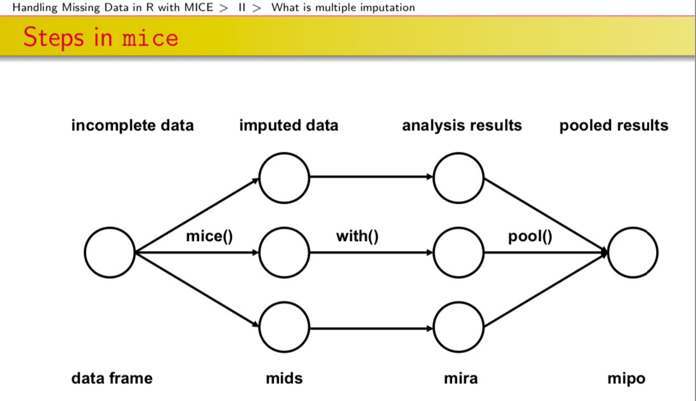

```{r xaringan-themer, include = FALSE}
library(xaringanthemer)
style_mono_accent(
  # base_color = "#275A53", #myrtle green
  # base_color = "#6A63DD",
  base_color = "#FFA3AF",
  header_font_google = google_font("Josefin Sans"),
  text_font_google   = google_font("Montserrat", "300", "300i"),
  code_font_google   = google_font("Droid Mono")
)
library(tidyverse)
```


# CAUSES AND CONSEQUENCES OF MISSING DATA

- `Causes`: 
  - Participant skipped the question
  - Participant refuses to cooperate
  - Data/coding error 
  - Drop outs from longitudinal research 
  - Question not asked
  - Censoring

- `Consequences`:
  - Less data than planned
  - Insufficient statistical power
  - Inconsistent sample sizes across analyses
  - Difficulty calculating even the most simple summary statistics
  - Difficulty determining appropriate confidence interval, p-values  
  - Systematic biases in the analysis 

**In sum, missing data can render analysis and interpretation difficult or impossible when unaddressed**

---
class: center, middle

# IMPUTING MISSING DATA

---

# MISSING DATA ASSUMPTIONS

According to Rubin (1976), there are 3 types of missing data assumptions:

- `MCAR`: Missing Completely at Random

Missing data is at random and the *pattern* of missing values is not related to the structure of the data. 

- `MAR`: Missing at Random

Missing data is not completely random and the probability of missingness relies on the observed data, not the missing data. 

- `MNAR`: Missing Not at Random

The missing data is not random and it's associated with factors that are unobservable and unknown to the analyst.

---

# OPTIONS YOU CAN TAKE 

- `List-wise deletion` 

  - Also called Complete Case Analysis (CCA)
  - Lose statistical power 
  - Large standard errors

- `Mean/median substitution`

  - Disturbs the distribution
  - Underestimates the variance 

---

# A BETTER OPTION

- `Multiple Imputation`

  - Accounts for the uncertainty around the "true" value
  - Obtains approximately unbiased estimates
  - Flexible to data type and analysis

The assumption is that **missing values can be imputed using predictions derived by the observable portion of the dataset**. 

If this assumption is not met, missing data cannot be imputed using multiple imputation. 

---

# APPROACHES TO MULTIPLE IMPUTATION

- `Joint Multivariate Normal Distribution Multiple Imputation`: 
  - Assumption: observed data follows a multivariate normal distribution
  - Disadvantage: if the data doesn't follow a the above distribution, the imputed values will be incorrect
  - 2 packages do this: `Amelia` and `norm`

- `Conditional Multiple Imputation`: 
  - Follows an iterative procedure, modeling the conditional distribution of a certain variable given the other variables 
  - Advantage: flexible because a distribution is assumed for **each** variable as opposed to the whole dataset 
    - `mice` does this (van Buuren, 2011)

---

# MICE

`mice` package computes missing data in 3 steps: mids (*multiply imputed data*), mira (*multiply imputed repeated analysis*) and mipo (*multiply imputed pooled object*)




--- 

# STEPS IN MICE 

`mice()` command assumes the specific distribution of the missing variable and draws from that distribution in order to replace missing values with possible values. Multiple complete datasets get generated, called **mids** which stands for **multiply imputed dataset**

`with()` command runs regressions for each complete dataset, generating `n` sets of coefficients. These analysis results are stored in an object of class **mira** which stands for **multiply imputed repeated analysis**

`pool()` command takes the mean of the `n` regression coefficients and estimates the variance (within and between the complete datasets)

---

class: center, middle

# PRACTICAL APPLICATION OF MICE

See `Practice.Rmd`

---

# Roadblocks  

- Violation of assumptions

- Too much missing data

- Wrong method in imputation

- High multicollinearity


`In conclusion, missing data imputation is a powerful method but it can be  hard to implement correctly.`

---

# RECAP OF NANIAR'S SUITE OF VISUALIZATIONS

- Shadow matrices, a tidy data structure for missing data:
  - `bind_shadow()`
  - `nabular()`
- Shorthand summaries for missing data:
  - `n_miss()`
  - `n_complete()`
  - `pct_miss()`
  - `pct_complete()`
- Numerical summaries of missing data in variables and cases:
  - `miss_var_summary()`
  - `miss_var_table()`
  - `miss_case_summary()`
  - `miss_case_table()`
- Visualisation for missing data:
  - `geom_miss_point()`
  - `gg_miss_var()`
  - `gg_miss_case()`
  - `gg_miss_fct()`
  
---

# REFERENCES

- Naniar package: https://github.com/njtierney/naniar
- Gallery of missing data visualizations: https://cran.r-project.org/web/packages/naniar/vignettes/naniar-visualisation.html 
- Van Buuren's course materials: https://stefvanbuuren.name/Winnipeg/Lectures/Winnipeg.pdf
- Vignettes for the `mice` package: 
  - (I): https://stefvanbuuren.name/Winnipeg/Practicals/Practical_I.html
  - (II): https://stefvanbuuren.name/Winnipeg/Practicals/Practical_II.html
  - (III): https://stefvanbuuren.name/Winnipeg/Practicals/Practical_III.html
  - (IV): https://stefvanbuuren.name/Winnipeg/Practicals/Practical_IV.html 
- Getting Started with Multiple Imputation in R, University of Virginia StatLab: https://uvastatlab.github.io/2019/05/01/getting-started-with-multiple-imputation-in-r/


